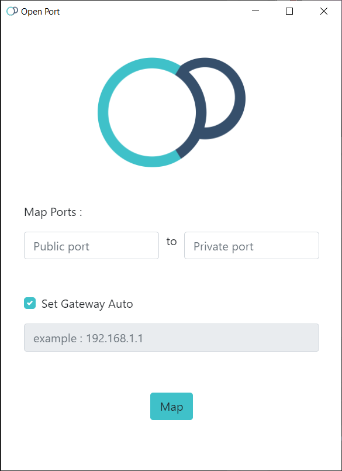

# open-port

  

language : [فارسی](/README.FA.MD) / [en](/README.MD)

## Table of Contents
- [open-port](#open-port)
  - [Table of Contents](#table-of-contents)
  - [About ](#about)
  - [Prerequisites](#prerequisites)
  - [Warning](#warning)
  - [Installing](#installing)
  - [Build](#build)

## About 
Open port is a simple app it can be used for port mappings / port forwarding on networks that support the UPNP protocol. And It's useful when you need to get access to your local network directly from the Internet by public IP.

## Prerequisites
Open port uses the UPNP protocol, which is usually is activated in modems. If it's not, you can activate it by referring to the modem settings.

## Warning
Open port uses the UPNP protocol to connect, which does not use any authentication method and is not the total secure protocol.

## Installing
You can go to [this page](https://github.com/alijany/Open-Port/releases/latest) to   install.

## Build
- Please make sure that NodeJS is installed on your system. (you can download it from [this link](https://nodejs.org/en/)).
- Open the project folder in the command-line then enter node I .  to install all dependencies of the project.
- the project will be start to build, and a folder named out gets created at the root of the project.

